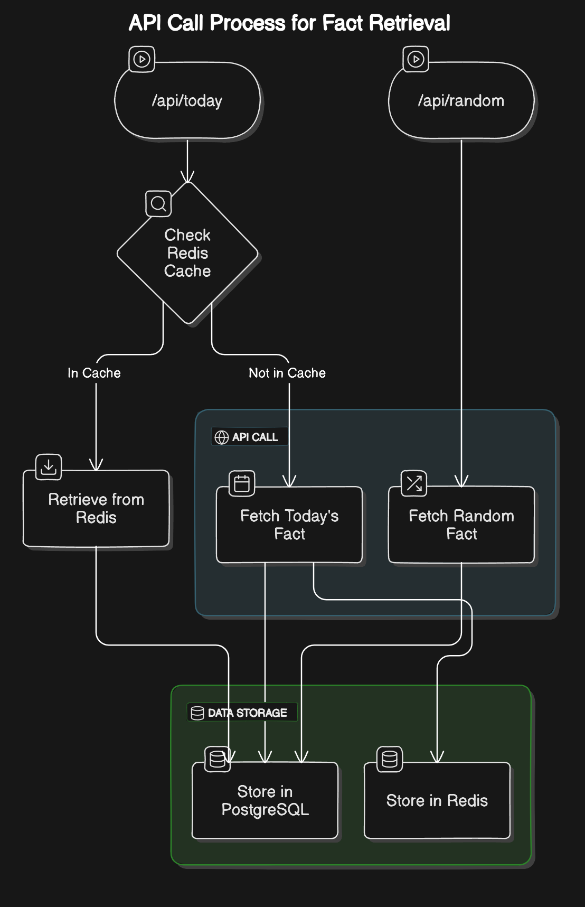

## Backend API Explanation (Theory)

In this Step, you will learn more about:

1. The structure and components of the backend API to be tested against
2. How the backend API works 

Let's get started!

## Main Components

The main components of the backend API are the following 

1. **Flask Application:**  
The file at **code/get.py** contains all the functionallity which the backend API provides and it does the following 

	- Defines API routes and their handlers
We have three endpoints **/api** a healthpoint for the API and the remaning two endopoints are **/api/random** and **/api/today**, these are our service endpoint which we provide 

   - Sets up the Flask application   
   - Manages interactions with external API and databases
   
2. **External API Integration:**  
Our backend API it provides *useless facts* and these come in two versions either a random fact which is retrieved at **/api/random**. The other version is "Fact of The Day" which is retrieved at **/api/today**. These facts are retrieved from another external API, more details found [here](https://uselessfacts.jsph.pl).
3. **Redis Caching:**
   - "Fact of The Day" is Cached using Redis to reduce external API calls, since it's the same fact
   - The cached fact will expire at midnight to ensure consistency
4. **PostgreSQL Database:**
	- Stores facts together with a view count
	- Uses upsert operations to update or add facts

The flowchart below showcases the backend API interaction with the various components. 